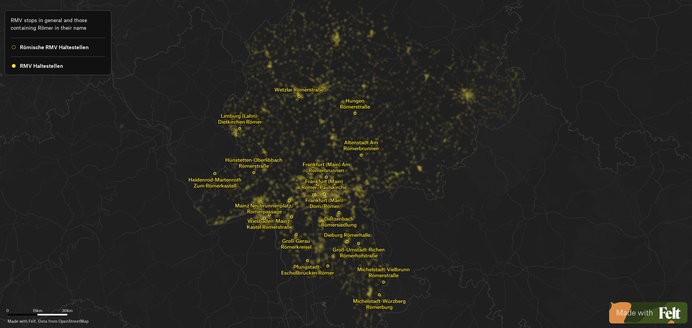
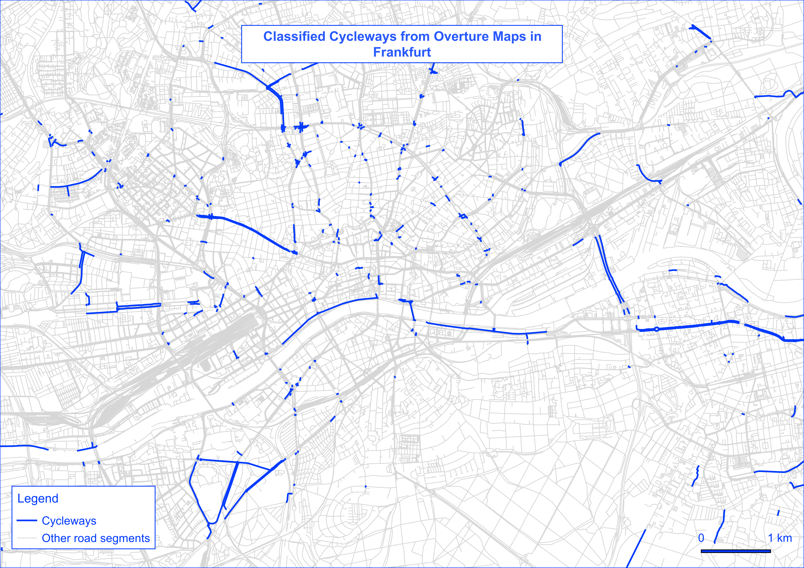
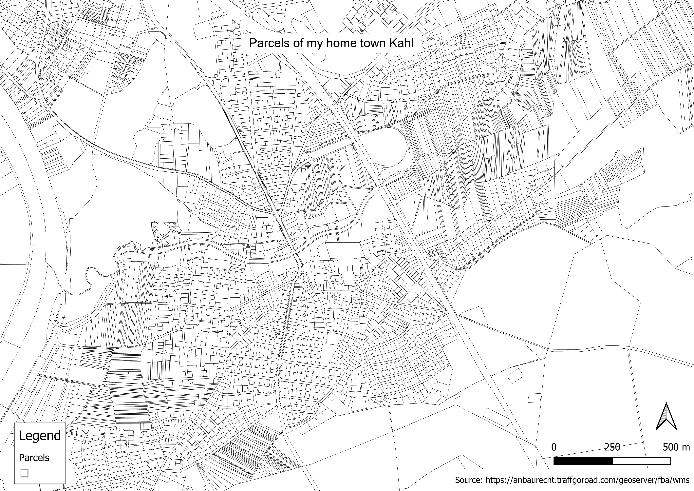
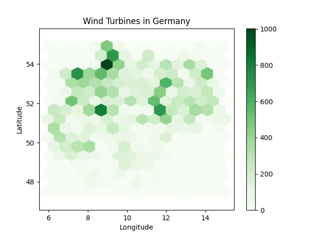

#2024

| Date       | Name                  | Description                                                                                                                                                                                                                                                                                                                                                                                                                                                                                                                                                                                                                                                                                                                                                                                                                     |
|------------|-----------------------|---------------------------------------------------------------------------------------------------------------------------------------------------------------------------------------------------------------------------------------------------------------------------------------------------------------------------------------------------------------------------------------------------------------------------------------------------------------------------------------------------------------------------------------------------------------------------------------------------------------------------------------------------------------------------------------------------------------------------------------------------------------------------------------------------------------------------------|
| 01-11-2024 | Points                | The roman empire made its way past Frankfurt and the RMV service area a long time ago. Unsurprisingly many stations contain the name "Römer". I used free accessible [data](https://opendata.rmv.de/site/files/rmv01/RMV_Haltestellen_Tarifperiode_2023_24_Stand_2024-07-09.zip) from RMV to map these stations. For the visualization I tried out [Felt](felt.com) for the first time. I had a tiny problem while uploading the csv file because Felt expects english decimal separators for longitude and latitude; Uploadw anything is their slogan :smile: Styling and filtering of the data worked very quickly and conveniently. This is the [result](https://felt.com/map/1-30daymapchallenge-2024-EXF6PTLcTOmRzzGz69C9CIXC?loc=50.2451,8.8352,9.04z&share=1).  |
| 02-11-2024 | Lines                 | For this challenge I used transportation data from [Overture Maps](https://overturemaps.org) that I downloaded with duckdb and python into a parquet file. Then I filtered the data in QGIS and created a map showing all road segments that have a cycleway classification only. The result:                                                                                                                                                                                                                                                                                                                                                                                                                                                                   |
| 03-11-2024 | Polygons              | Parcels in Germany are usually pain to work with. With this [WMS](https://anbaurecht.traffgoroad.com/geoserver/fba/wms) from the [Fernstraßenbundesamt](https://www.fba.bund.de/DE/Home/home_node.html) you get geometries and public properties. I created a map of parcels in my home town to show the diversity in size and geometry. The result:                                                                                                                                                                                                                                                                                                                                                                                                                                                |
| 04-11-2024 | Hexagons              | [Overpass Turbo](https://overpass-turbo.eu) is a great tool to request data from OSM. For this challenge I pulled wind turbines with the Overpass API from OSM and used matplotlib to create hexagons:                                                                                                                                                                                                                                                                                                                                                                                                                                                                                                                                                                              |
| 05-11-2024 | A journey             | The German Circle: May of this year was my first trip to the US. Mainly California, Nevada and a tiny bit of Utah. I used qgis to create a point layer with dates from my trip and the in-built temporal controller to style the points as heatmap and export the frames. As background I used the Dark theme from [terrestris](https://ows.terrestris.de/osm/service?VERSION=1.1.1). The result:                                                                                                                                                                                                                                                                                                                                                                                                           |
| 06-11-2024 | Raster                | A map using raster data. Rasters are everywhere, but today’s focus is purely on grids and pixels—satellite imagery, heatmaps, or any continuous surface data. 🟦🟧                                                                                                                                                                                                                                                                                                                                                                                                                                                                                                                                                                                                                                                              |
| 07-11-2024 | Vintage style         | Map something modern in a vintage aesthetic. Create a map that captures the look and feel of historical cartography but focuses on a contemporary topic. Use muted colors, fonts, and classic elements. 🕰️🗺️                                                                                                                                                                                                                                                                                                                                                                                                                                                                                                                                                                                                                  |
| 08-11-2024 | Humanitarian Data Exchange (HDX) | Use data from HDX to map humanitarian topics. Explore the datasets from the Humanitarian Data Exchange, covering disaster response, health, population, and development. Map for social good. 🌍🚑                                                                                                                                                                                                                                                                                                                                                                                                                                                                                                                                                                                                                              |
| 09-11-2024 | AI only               | This day is all about prompt engineering. Use AI tools like DALL-E, MidJourney, Stable Diffusion, or ChatGPT with geospatial capabilities to create a map based on AI-generated content. The challenge is to get the right prompt and critically assess the output—how well does AI capture or distort the map's intent?                                                                                                                                                                                                                                                                                                                                                                                                                                                                                                        |
| 10-11-2024 | Pen & paper           | Draw a map by hand. Go analog and draw a map using pen and paper. The result doesn’t have to be perfect—it’s about the creative process. ✏️🗺️                                                                                                                                                                                                                                                                                                                                                                                                                                                                                                                                                                                                                                                                                  |
| 11-11-2024 | Arctic                | Map the Arctic. Whether it’s ice coverage, wildlife habitats, or the effects of climate change, this day is all about mapping the cold extremes of the Arctic. ❄️🧊                                                                                                                                                                                                                                                                                                                                                                                                                                                                                                                                                                                                                                                             |
| 12-11-2024 | Time and space        | Map something where time matters. Visualize change over time—urban growth, migration, or environmental shifts. Show the relationship between time and geography. ⏳🌍                                                                                                                                                                                                                                                                                                                                                                                                                                                                                                                                                                                                                                                            |
| 13-11-2024 | A new tool            | Use a tool you’ve never tried before. The challenge has always been about trying new things. Use a tool, software, or drawing technique you’ve never worked with before. 🧪🔧                                                                                                                                                                                                                                                                                                                                                                                                                                                                                                                                                                                                                                                   |
| 14-11-2024 | A world map           | Map the whole world. Whether it’s continents, ecosystems, or oceans, this is the day to map the entire planet. 🌍                                                                                                                                                                                                                                                                                                                                                                                                                                                                                                                                                                                                                                                                                                               |
| 15-11-2024 | My data               | Map something personal. Map data from your own life—this could be places you’ve traveled, your daily routine, or any other personal touch. 🗒️                                                                                                                                                                                                                                                                                                                                                                                                                                                                                                                                                                                                                                                                                  |
| 16-11-2024 | Choropleth            | Classic choropleth map. Use color to show data variation across regions. This simple but effective technique is a staple for showing thematic differences. 🎨                                                                                                                                                                                                                                                                                                                                                                                                                                                                                                                                                                                                                                                                   |
| 17-11-2024 | Collaborative map     | Collaborate with others on a single map. For today’s challenge, team up! Whether you work with one person or several, the idea is to combine your efforts on a single map. 🤝🗺️                                                                                                                                                                                                                                                                                                                                                                                                                                                                                                                                                                                                                                                |
| 18-11-2024 | 3D                    | Map with depth. Add a third dimension to your map. Whether it’s visualizing elevation, buildings, or something more abstract, today’s about thinking beyond flat surfaces. 🎢🏔️                                                                                                                                                                                                                                                                                                                                                                                                                                                                                                                                                                                                                                                |
| 19-11-2024 | Typography            | Map focused on typography. Let text and words do the heavy lifting today. Whether you’re focusing on place names, labeling, or using text to create shapes and patterns. ✍️🅰️                                                                                                                                                                                                                                                                                                                                                                                                                                                                                                                                                                                                                                                  |
| 20-11-2024 | OpenStreetMap         | Use OpenStreetMap data to create something. OpenStreetMap offers rich, editable data from roads to buildings and beyond. The goal is to showcase the power of this community-driven dataset. 🗺️📍                                                                                                                                                                                                                                                                                                                                                                                                                                                                                                                                                                                                                              |
| 21-11-2024 | Conflict              | Map a conflict. Political, territorial, or social—there are conflicts all around us. Map boundaries, tension points, or the outcomes of conflicts. ⚔️🛑                                                                                                                                                                                                                                                                                                                                                                                                                                                                                                                                                                                                                                                                         |
| 22-11-2024 | 2 colours             | Create a map using only 2 colors. No gradients or shading—just two flat colors. This restriction encourages creativity in design and forces you to think about how to clearly convey your message with minimal color.                                                                                                                                                                                                                                                                                                                                                                                                                                                                                                                                                                                                           |
| 23-11-2024 | Memory                | Map based on memory. Create a map of a place you remember—hometown, favorite destination, or somewhere meaningful. It doesn’t need to be perfectly accurate, just how you recall it. 💭🗺️                                                                                                                                                                                                                                                                                                                                                                                                                                                                                                                                                                                                                                      |
| 24-11-2024 | Only circular shapes  | Map using only circles. Everything should be circular. Forget straight lines and sharp edges, and see how creative you can get by sticking to round shapes. 🔵⭕                                                                                                                                                                                                                                                                                                                                                                                                                                                                                                                                                                                                                                                                 |
| 25-11-2024 | Heat                  | Map something related to heat. Focus on heat, whether it’s actual temperature or areas of intensity—like heatmaps of activity or metaphorical heat. 🔥🌡️                                                                                                                                                                                                                                                                                                                                                                                                                                                                                                                                                                                                                                                                       |
| 26-11-2024 | Map projections       | Explore different map projections and how they distort the world. Whether it's focusing on the classic Mercator, the Peters projection, or a more obscure one like the Waterman Butterfly, today is about playing with how we represent the round Earth on flat surfaces.                                                                                                                                                                                                                                                                                                                                                                                                                                                                                                                                                       |
| 27-11-2024 | Micromapping          | Map something small and precise. Zoom in and map a small area in high detail. It could be a single building, a street corner, or a tiny plot of land. Focus on accuracy at a small scale. 🧐🔍                                                                                                                                                                                                                                                                                                                                                                                                                                                                                                                                                                                                                                  |
| 28-11-2024 | The blue planet       | Map oceans, rivers, and lakes. Focus on water today. Map the oceans, rivers, or lakes, diving deep into marine environments or water systems. 🌊🐋                                                                                                                                                                                                                                                                                                                                                                                                                                                                                                                                                                                                                                                                              |
| 29-11-2024 | Overture              | Use data from the Overture Maps Foundation. Explore data from Overture Maps Foundation to create a map that highlights new geographic datasets. A great opportunity to dive into open geospatial data! 🌍📊                                                                                                                                                                                                                                                                                                                                                                                                                                                                                                                                                                                                                     |
| 30-11-2024 | The final map         | The final challenge—your choice! Revisit a technique from earlier in the month, refine an idea, or try something completely new. End the challenge on a high note with a map that showcases your creativity, growth, or just pure fun! 🎉🌐                                                                                                                                                                                                                                                                                                                                                                                                                                                                                                                                                                                     |